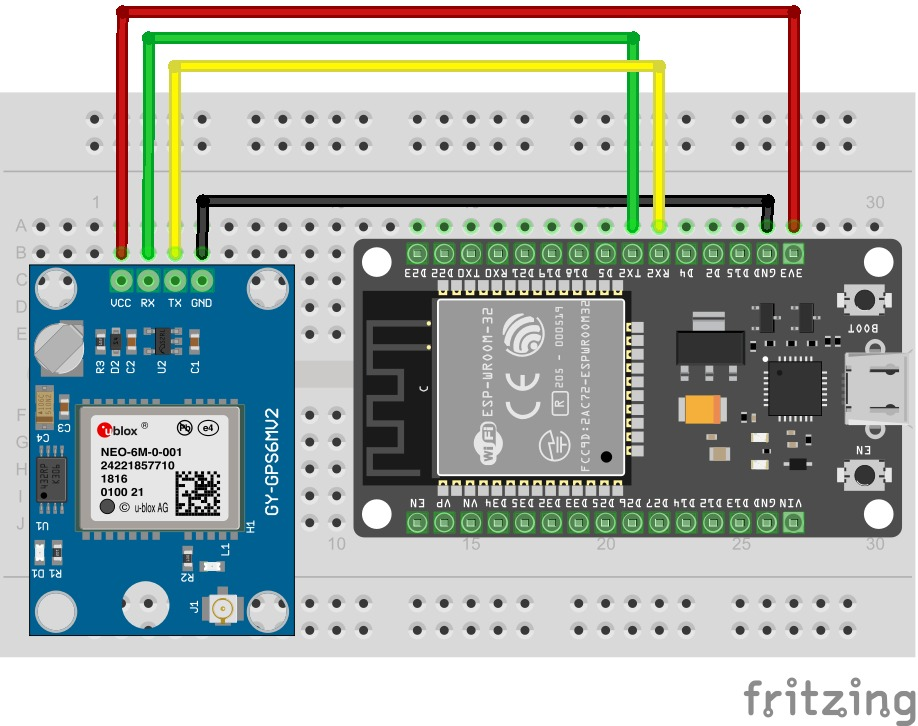

# ESP32_GPS_tracker: Rastreador GPS com ESP32

O **ESP32_GPS_tracker** é um projeto baseado no microcontrolador ESP32 que realiza a leitura de coordenadas GPS em tempo real e envia esses dados via HTTP para um servidor remoto. Ele é ideal para aplicações de rastreamento de veículos, monitoramento de ativos móveis e projetos de geolocalização embarcada.

<div style="display: inline_block"><br>
    
    
</div>

---

## O que é o ESP32_GPS_tracker?

Este projeto une três pilares principais:
1. **ESP32**: Microcontrolador com conectividade Wi-Fi e Bluetooth.
2. **Módulo GPS**: Responsável por capturar as coordenadas de latitude, longitude e altitude em tempo real.

Com o ESP32_GPS_tracker, você pode:
- **Ler coordenadas GPS** com alta precisão.
- **Transmitir os dados via HTTP POST** de forma confiável.
- **Visualizar em tempo real** a posição em dashboards ou aplicativos de rastreamento.

---

## Como Funciona?

1. **Leitura dos Dados GPS**:
   - O ESP32 lê os dados de um módulo GPS via UART (por exemplo, NEO-6M ou similar).
   - As sentenças NMEA são interpretadas para extrair os dados relevantes.

2. **Publicação HTTP**:
   - Os dados são enviados para um Servidor web configurado (como Heroku, etc).
   - As mensagens seguem um formato JSON para fácil leitura e integração.

3. **Visualização dos Dados**:
   - Os dados podem ser consumidos por um aplicativo web, desktop ou mobile para visualização em mapas.

---

## Como Usar?

### Pré-requisitos

- **ESP32** com suporte a UART (ex: DEVKIT V1).
- **Módulo GPS** (ex: NEO-6M).
- **Servidor web**.
- **PlatformIO** instalado no VS Code ou **Arduino IDE** (copie o código em `src/main.cpp` e `include/opening.h` para a mesma pasta. O `.cpp` deve ser convertido em `.ino`).
- **Bibliotecas Necessárias**: `WiFiManager`, `Adafruit GFX Library`, `Adafruit SSD1306`.

### Passos para Executar

1. **Clone o Repositório**:
```bash
git clone https://github.com/vitorshaft/ESP32_GPS_tracker.git
cd ESP32_GPS_tracker
```

2. **Conecte o Módulo GPS ao ESP32**:
   - RX do GPS → pino TX do ESP32
   - TX do GPS → pino RX do ESP32

<div style="display: inline_block"><br>
    
</div>

3. **Compile e Envie o Código**:
   - Utilize o PlatformIO para compilar e enviar o firmware para o ESP32.

4. **Verifique a Comunicação**:
   - Acompanhe a saída serial no VSCode para verificar as leituras GPS e os envios via HTTP POST.

5. **Configure as credenciais WiFi**:
   - Acesse o Monitor Serial
   - Acesse a rede `ESP32` com a senha `1234567890`
   - Observe o IP exibido no Monitor Serial e acesse-o com seu navegador
   - Selecione a rede WiFi e insira a senha

---

## Aplicações do ESP32_GPS_tracker

- **Rastreamento de veículos** em tempo real.
- **Monitoramento de frotas** com integração em dashboards.
- **Localização de ativos móveis** (containers, bicicletas, drones).
- **Projetos acadêmicos de geolocalização**.

## Observações

- **Disponibilidade de sinal**: Se você estiver em um ambiente fechado ou com relevo muito acidentado, talvez o sinal de GPS não seja encontrado pelo módulo. **Você saberá que deu certo se ele piscar um LED azul**.
- **Acurácia**: Do mesmo modo, a qualidade do sinal varia de acordo com a sua visibilidade para a constelação GPS. Prefira lugares abertos, sem obstruções de edifícios ou relevo.

---

## Contribuição

Contribuições são muito bem-vindas! Para colaborar:

1. Faça um fork do projeto.
2. Crie uma branch (`git checkout -b feature/nova-feature`).
3. Commit suas alterações (`git commit -m 'Minha nova feature'`).
4. Push para a branch (`git push origin feature/nova-feature`).
5. Abra um Pull Request.

---

## Contato

- **Nome**: Vitor Domingues
- **Email**: vdmrvitor@gmail.com
- **GitHub**: [vitorshaft](https://github.com/vitorshaft)